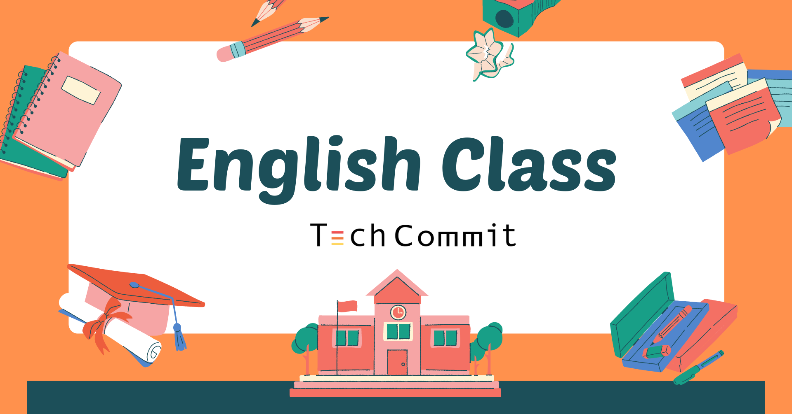
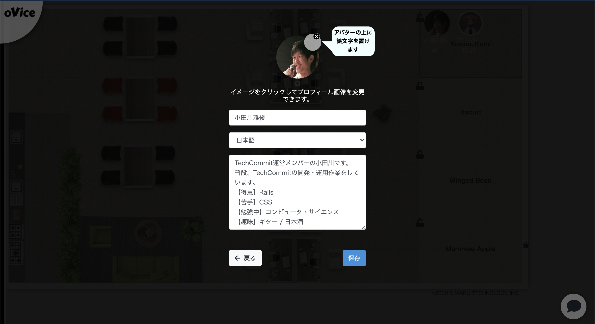

## もくもく会とは？
IT業界の勉強会でよく聞く「もくもく会」ですが、馴染みのない方もいるでしょう。  
一言でいえば、もくもく会とは「**自習型の勉強会**」を総称した呼び方です。

一般的に、各自で学習したい内容や教材を持ち込んで学習を進める、いわば学習塾等にあるコワーキングスペースのようなものです。  
技術的なテーマを決めている場合もあれば自由に実施する場合もあります。

## TechCommitのオンラインもくもく会の活用法
TechCommitでは**毎日20時からもくもく会を開催**しています。  
TechCommitのSlackに参加済の方は誰でも参加できますので、**学習習慣を身に付ける**ためにご利用下さい。

仕事で忙しい方などは**曜日を決めてGoogleカレンダーに予定として投入しておく**と良いでしょう。

もくもく会にはスタッフが常駐しています。
もくもく会中に**分からないことがあれば同じ分野を学習している仲間やファシリテーターにも相談してみましょう**。

## もくもく会で解決した質問
- コードを書いていてエラーの原因が分からなかったが、仲間やファシリテーターに教えてもらって解決できた。
- 教材に書いてある内容の意味がよく分からなかったが、同じ教材を使って学習していた仲間がいて教えてもらえた。
- 自分に合った教材を紹介してもらえた。
- 学習方針について相談に乗ってもらえた。

## 英語もくもく会

毎日開催しているもくもく会のうち、**隔週土曜日を英語学習を推奨する「英語もくもく会」**とし、英語に触れる機会を持って欲しいという思いで開催しています。  
英語を話さないといけないというスパルタな会ではありません。  

### エンジニアスキル向上に英語は欠かせない
エンジニアとしてのスキルを向上させるためには英語は避けられません。  
プログラミングのエラーメッセージはほとんどが英語ですし、英語で書かれたドキュメントしか存在しない場合もあります。

また、検索するときも英語で書かれた情報を理解できれば、多くの情報に触れることができるので、英語のスキルは問題解決の手助けになります。

もくもく会参加者の中には、中学生の英語から学び直している人、英語で書かれたプログラミング教材に取り組む人もいます。  
何を使ってどのように学習すればいいのか分からない場合は、まずはファシリテーターに相談してみましょう。

▼英語ファシリテーターが書いた記事もぜひ参考にしてください。  
[英語学習ロードマップ](https://note.com/eve_key/n/na61d3ca13797)  
[ITエンジニアのための英語学習メディアまとめ](https://www.tech-training.jp/blog/entries/3)

### 英語もくもく会で解決した質問
- 文章の意味が分からず解説してもらって理解できた。
- 英語の聞き取りのコツを聞いてみたら、音がどのように繋がったり欠落したりするかの法則を知ると良いと教えてもらえた。
- どんなツールを使うと良いか聞いたら、ポップアップ辞書ツールを勧めてもらった。
- 自分のレベルにあった勉強法や教材を教えてもらえた。

ぜひ、この機会に技術だけではなく英語の学習習慣を身に付けていきましょう。

### 必ずしも英語でなくてOK
英語ではなく技術の学習をしたい方もいらっしゃると思うので、必ずしも英語の勉強でなくても参加して構いません。  
ただし、**英語に強みのあるファシリテーターが担当します**のでご了承ください。

## もくもく会の疑問
オンラインもくもく会について解説しましたが、初めて参加する方にとっては、実態が分からず不安に思うかもしれません。  
よくありそうな疑問についてお答えしてみました。  

 

**Q. 途中参加・途中退出はできる？**  
**A. はい、いつでもどうぞ！**

 
 

**Q. ビデオ通話だから顔を出していないとダメ？**  
**A. 音声のみ、Slackのみ参加も可能です。**

実際に音声のみで参加されている方がいらっしゃいますが、ビデオ通話の方と同様にコミュニケーションをとることができます。  
映像の切り替え方などoViceの使い方については[oViceの導入](/tutorial/preparation/#ovice)も参照ください
 
 
 

**Q. マイクがないとダメ？**  
**A. テキスト（Slack）のみの参加も可能です。**  

1. oViceに参加してコワーキングスペースのような雰囲気を体感しながらSlackだけでコミュニケーションをとる。
2. oViceに参加しないでSlackだけでコミュニケーションをとりながら同じ時間を共有して学習する。

どちらも歓迎しますので、ご自身のスタイルに合わせてご参加ください。
 
 
 

**Q. プライベートな音を入れたくないのですが。**  
**A. oViceはミュート機能があり、自分の音声を聞かれたくない場合は音声をオフにすることができます。**  

Slackのチャットでもコミュニケーションを取っているため、oViceの音声は終始オフにしたままでも問題ありません。
 
 
 

**Q. どれくらいの人数が参加するの？雰囲気は？**  
**A. 曜日にもよりますが３〜１０人程度です。**  

集中してもくもくと学習する方、たまに雑談される方、それぞれいらっしゃいます。
 
 
 

**Q. 学習で対応している技術は？**  
**A. 基本的には「コワーキングスペース」という扱いのため、どんな技術の学習をされても問題ありません。**

ファシリテーターにも得意分野がありますが、特定の分野の得意なファシリテーターが参加する日に参加すると問題解決などは行いやすいでしょう。

## 参加の流れ
オンラインもくもく会の参加の流れについて解説します。
### Slackのもくもく会チャンネルに参加する
まずは、自分がSlack **#20_もくもく部屋** チャンネルに参加しているか確認してみてください。
チャンネルの検索方法は[Slackチャンネルの参加方法](tutorial/join-slack-channel.md)を参考にしてください。

oVice入室などの案内は毎回 **#20_もくもく部屋** チャンネルで行いますので、利用する場合は参加しておきましょう。

### oViceのマイプロフィールを設定する
もくもく会の開催は[oVice（オヴィス）](というビデオ通話ツールで行います。  
基本的にoVice上の名前を**Slack上の表示名**と合わせていただくようお願いしています。

名前を固定で設定したり、アイコン等各種設定をする場合にはoViceのプロフィールから変更できます。  
会員登録をしておけば入室のたびに変更しなくて済むようになります。  
会員登録をしなくてもoVice自体は利用可能ですが、その場合はoVice入室後変更いただけますと幸いです。

### 開催場所を確認して入室する
oViceの準備がまだできていない方は[oViceの導入](/tutorial/preparation/#ovice)を参考にしてください。

もくもく会の準備が整うと **#20_もくもく部屋**チャンネルに、開催する部屋のURLともくもく会開始のアナウンスが流れます。  
URLにアクセスしてoViceに参加しましょう。

### テンプレートに沿って学習宣言する

テンプレートに沿って学習する内容を共有しましょう。  
他のメンバーの学習内容も見て話しかけてみたり、Slackで返信して学習仲間を作ってみてください。  
もし勇気がなければ絵文字のリアクションから始めてみましょう。

### 終了時は進捗を共有する

**21:45**に終了のアナウンスを流します。
テンプレートに沿って学の進捗を共有しましょう。

ファシリテーターは22:00に退出しますが部屋は開放しておきますので、  
継続して学習したい場合はそのまま在室して構いません。
